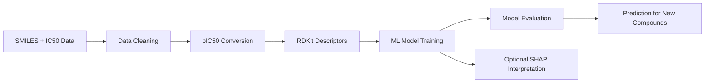

# QSAR IC50 Prediction using RDKit, Machine Learning, and SHAP


<p align="center">
A reproducible machine-learning QSAR workflow for IC50/pIC50 prediction using SMILES-based molecular descriptors, regression models, and optional SHAP interpretation.
</p>

---

## Project Overview

This repository demonstrates an end-to-end **QSAR (Quantitative Structure-Activity Relationship)** workflow for predicting biological activity from chemical structure.

The public version uses a small demo dataset so the workflow can be shared safely without exposing confidential project data.

### Main goals

- clean compound activity data
- convert IC50 values to pIC50
- validate SMILES strings
- generate RDKit molecular descriptors
- train baseline ML regression models
- evaluate model performance
- save prediction tables and figures
- predict activity for new compounds
- optionally interpret model behavior using SHAP

---

## QSAR or QSPR?

This project is **QSAR**, not QSPR.

| Term | Meaning | Example target |
|---|---|---|
| QSAR | Quantitative Structure-Activity Relationship | IC50, pIC50, Ki, EC50 |
| QSPR | Quantitative Structure-Property Relationship | solubility, logP, melting point |

Because this project predicts **IC50/pIC50**, it is a QSAR workflow.

---

## Repository Structure

```text
.
├── data/
│   ├── sample_qsar_dataset.csv
│   ├── new_compounds.csv
│   └── README.md
├── docs/
│   ├── methodology.md
│   ├── limitations.md
│   └── confidentiality_note.md
├── notebooks/
│   ├── 01_data_preprocessing.ipynb
│   ├── 02_descriptor_generation.ipynb
│   ├── 03_model_training_evaluation.ipynb
│   ├── 04_shap_interpretation.ipynb
│   └── 05_new_compound_prediction.ipynb
├── scripts/
│   ├── preprocess_data.py
│   ├── generate_descriptors.py
│   ├── train_models.py
│   ├── evaluate_models.py
│   ├── shap_analysis.py
│   └── predict_new_compounds.py
├── results/
│   ├── figures/
│   ├── tables/
│   └── models/
├── README.md
├── requirements.txt
├── environment.yml
├── LICENSE
└── .gitignore
```

---

## Workflow



---

## Scripts

| Script | Purpose |
|---|---|
| `preprocess_data.py` | Cleans QSAR input data and converts IC50 to pIC50 |
| `generate_descriptors.py` | Calculates RDKit descriptors from SMILES |
| `train_models.py` | Trains Ridge, ElasticNet, and Random Forest models |
| `evaluate_models.py` | Creates model-performance comparison plots |
| `shap_analysis.py` | Runs optional SHAP-based model interpretation |
| `predict_new_compounds.py` | Predicts pIC50 and IC50 for new compounds |

---

## Installation

### Recommended: Conda

```bash
conda env create -f environment.yml
conda activate qsar-ml
```

### Alternative: Python virtual environment

```bash
python -m venv .venv
source .venv/bin/activate
pip install -r requirements.txt
```

RDKit installation is usually more reliable through Conda.

---

## How to Run

Run from the repository root:

```bash
python scripts/preprocess_data.py
python scripts/generate_descriptors.py
python scripts/train_models.py
python scripts/evaluate_models.py
python scripts/predict_new_compounds.py
```

Optional SHAP interpretation:

```bash
python scripts/shap_analysis.py
```

---

## Expected Outputs

| Output | Description |
|---|---|
| `results/tables/clean_qsar_dataset.csv` | Cleaned activity dataset |
| `results/tables/qsar_descriptors.csv` | RDKit descriptor table |
| `results/tables/model_performance.csv` | Model evaluation summary |
| `results/tables/predictions_demo.csv` | Test-set predictions |
| `results/tables/new_compound_predictions.csv` | Predictions for new compounds |
| `results/figures/predicted_vs_observed.png` | Observed vs predicted pIC50 plot |
| `results/figures/model_mae_comparison.png` | Model MAE comparison plot |
| `results/figures/shap_summary.png` | Optional SHAP summary plot |

---

## Notes on Data

The original confidential/client dataset is not included in this public repository. Instead, `data/sample_qsar_dataset.csv` provides a small demonstration dataset to show the structure of the workflow.

For a real QSAR study, use a larger curated dataset with consistent assay conditions, external validation, and applicability-domain analysis.

---

## Skills Demonstrated

- cheminformatics with RDKit
- QSAR data preprocessing
- IC50 to pIC50 conversion
- molecular descriptor generation
- machine learning regression modeling
- model evaluation with R², MAE, and RMSE
- new-compound activity prediction
- optional SHAP explainability
- reproducible Python project organization

---

## Author

**Hazrat Maghaz**  
Bioinformatician | Computational Biologist | AI-driven Drug Discovery

- Website: https://hazratmaghaz.tech
- GitHub: https://github.com/HazratMaghaz
- LinkedIn: https://www.linkedin.com/in/hazrat-maghaz-6967b9374/

---

## License

This repository is available under the MIT License. See the `LICENSE` file for details.
