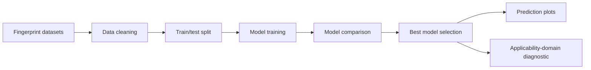

# QSAR IC50/pIC50 Prediction using Molecular Fingerprints, Machine Learning, and SHAP


<p align="center">
A reproducible AI-based QSAR workflow for pIC50 prediction using molecular fingerprints, machine-learning regression models, model comparison, and applicability-domain diagnostics.
</p>

---

## Project Overview

This repository demonstrates an end-to-end **QSAR (Quantitative Structure-Activity Relationship)** workflow for predicting biological activity from molecular fingerprint descriptors.

The project now contains two dataset tracks:

1. **Demo SMILES dataset** for showing the general RDKit descriptor pipeline.
2. **Legacy fingerprint QSAR datasets** containing 987 learning-project compounds represented using multiple molecular fingerprint types.

The main modeling workflow focuses on the fingerprint datasets because they are large enough for meaningful machine-learning comparison.

---

## QSAR or QSPR?

This project is **QSAR**, not QSPR.

| Term | Meaning | Example target |
|---|---|---|
| QSAR | Quantitative Structure-Activity Relationship | IC50, pIC50, Ki, EC50 |
| QSPR | Quantitative Structure-Property Relationship | solubility, logP, melting point |

Because the target variable is **pIC50**, this is a QSAR workflow.

---

## Dataset Summary

The fingerprint workflow uses 12 molecular fingerprint datasets stored in:

```text
data/legacy_fingerprints/
```

Each dataset contains molecular fingerprint features and a `pIC50` target column.

| Dataset type | Purpose |
|---|---|
| MACCS keys | Compact structural key representation |
| PubChem fingerprints | Public chemical substructure fingerprints |
| Klekota-Roth fingerprints | Larger pharmacophore/substructure-style fingerprints |
| AtomPairs2D fingerprints | Atom-pair molecular representation |
| Substructure fingerprints | Simple substructure presence/count features |
| E-state fingerprints | Electrotopological-state descriptors |
| Extended fingerprints | High-dimensional fingerprint representation |

The clean fingerprint workflow compares multiple models across all available fingerprint files.

---

## Current Best Result

The fingerprint model-comparison workflow produced the following best result:

| Best fingerprint dataset | Best model | R² | MAE | RMSE |
|---|---:|---:|---:|---:|
| `KlekotaRoth_FingerprintCount.csv` | ExtraTrees | 0.6787 | 0.5698 | 0.7573 |

Results are saved in:

```text
results/tables/fingerprint_model_metrics.csv
results/tables/best_model_predictions.csv
results/figures/model_comparison_by_fingerprint.png
results/figures/best_model_predicted_vs_actual.png
results/figures/williams_plot_demo.png
results/models/best_qsar_model.joblib
```

---

## Repository Structure

```text
.
├── data/
│   ├── legacy_fingerprints/
│   ├── sample_qsar_dataset.csv
│   ├── new_compounds.csv
│   └── README.md
├── docs/
│   ├── methodology.md
│   ├── limitations.md
│   ├── confidentiality_note.md
│   ├── fingerprint_dataset_summary.md
│   ├── fingerprint_file_inventory.csv
│   └── legacy_code_mapping.md
├── notebooks/
│   ├── 01_data_preprocessing.ipynb
│   ├── 02_descriptor_generation.ipynb
│   ├── 03_model_training_evaluation.ipynb
│   ├── 04_shap_interpretation.ipynb
│   ├── 05_new_compound_prediction.ipynb
│   ├── 06_fingerprint_model_comparison.ipynb
│   ├── 07_shap_interpretation.ipynb
│   ├── 08_applicability_domain_williams_plot.ipynb
│   ├── 09_new_compound_prediction.ipynb
│   └── legacy_reference/
├── scripts/
│   ├── preprocess_data.py
│   ├── generate_descriptors.py
│   ├── train_models.py
│   ├── evaluate_models.py
│   ├── shap_analysis.py
│   ├── predict_new_compounds.py
│   ├── train_fingerprint_qsar_models.py
│   └── applicability_domain.py
├── results/
│   ├── figures/
│   ├── tables/
│   └── models/
├── archive/
│   └── legacy_r_models/
├── README.md
├── requirements.txt
├── environment.yml
├── LICENSE
└── .gitignore
```

---

## Workflow



---

## Scripts

| Script | Purpose |
|---|---|
| `preprocess_data.py` | Cleans demo SMILES/IC50 dataset and converts IC50 to pIC50 |
| `generate_descriptors.py` | Generates RDKit descriptors for demo SMILES data |
| `train_models.py` | Trains baseline QSAR models on demo descriptors |
| `evaluate_models.py` | Evaluates saved prediction tables |
| `shap_analysis.py` | Provides optional SHAP interpretation workflow |
| `predict_new_compounds.py` | Predicts pIC50 for new demo compounds |
| `train_fingerprint_qsar_models.py` | Trains and compares ML models across 12 fingerprint datasets |
| `applicability_domain.py` | Generates residual/applicability-domain style diagnostic plot |

---

## Notebooks

| Notebook | Purpose |
|---|---|
| `01_data_preprocessing.ipynb` | Introduces dataset structure and preprocessing |
| `02_descriptor_generation.ipynb` | Explains descriptor/fingerprint feature matrices |
| `03_model_training_evaluation.ipynb` | Runs or summarizes model training and evaluation |
| `04_shap_interpretation.ipynb` | Describes SHAP explainability direction |
| `05_new_compound_prediction.ipynb` | Demonstrates prediction workflow concept |
| `06_fingerprint_model_comparison.ipynb` | Summarizes real fingerprint model comparison |
| `08_applicability_domain_williams_plot.ipynb` | Shows applicability-domain diagnostic output |

---

## Installation

### Option 1: Conda

```bash
conda env create -f environment.yml
conda activate qsar-ml
```

### Option 2: pip/venv

```bash
python -m venv .venv
source .venv/bin/activate
pip install -r requirements.txt
```

For RDKit-based workflows, conda is recommended.

---

## How to Run

Train and compare fingerprint QSAR models:

```bash
python scripts/train_fingerprint_qsar_models.py
```

Generate applicability-domain diagnostic:

```bash
python scripts/applicability_domain.py
```

Run the notebooks from the repository root using Jupyter or VS Code.

---

## Important Notes

- The fingerprint datasets were used for personal QSAR learning and portfolio demonstration.
- The raw legacy folder `QSAR Codes/` is intentionally ignored and not tracked.
- The polished repository contains cleaned datasets, notebooks, scripts, documentation, and generated results.
- Some notebooks are designed as explanatory workflow notebooks and may call scripts instead of duplicating all pipeline code.

---

## Skills Demonstrated

- QSAR modeling
- pIC50 prediction
- Molecular fingerprints
- Model comparison across descriptor sets
- Regression model evaluation
- ExtraTrees/RandomForest/ElasticNet/GradientBoosting modeling
- Applicability-domain style diagnostics
- Jupyter-based scientific reporting
- Clean repository organization

---

## Author

**Hazrat Maghaz**  
Bioinformatician | Computational Biologist | AI-driven Drug Discovery Enthusiast

- Website: https://hazratmaghaz.tech
- GitHub: https://github.com/HazratMaghaz
- LinkedIn: https://www.linkedin.com/in/hazrat-maghaz-6967b9374/

---

## License

This repository is available under the MIT License. See the `LICENSE` file for details.
